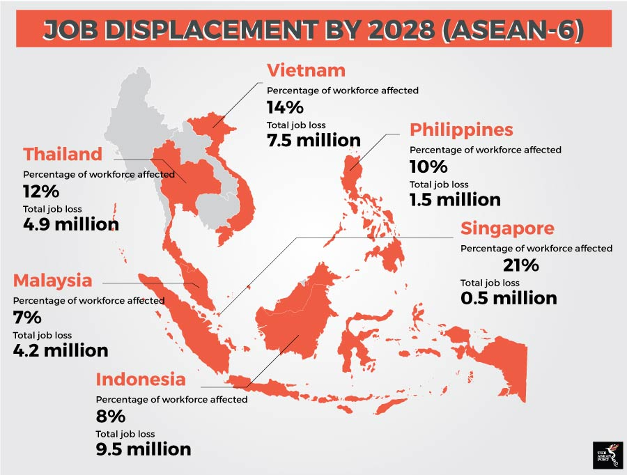
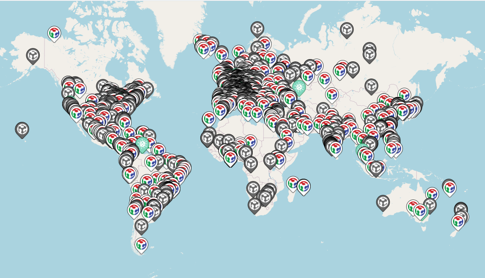

# What is Digital Fabrication

## Digital Fabrication

- [Digital Fabrication is MORE than 3D Printing](https://www.wired.co.uk/article/digital-fabrication)
- [How to Make Almost Anything](http://cba.mit.edu/docs/papers/12.09.FA.pdf)

## [Digital Modeling & Fabrication](https://en.wikipedia.org/wiki/Digital_modeling_and_fabrication)

- design and production process that combines
  - 3D modeling or Computer Aided Design with
  - additive manufacturing
  - subtractive manufacturing
  - other technologies
- to physically produce the designed objects

## [Opendesk definition](https://www.opendesk.cc/about/digital-fabrication)

- a type of manufacturing process where machine is controlled by a computer
- the most common forms:
  - **CNC Machining**: typically shapes cut out of sheets or blocks of material
  - **3D Printing**: objects are built up out of layers of metal or plastic
  - **Laser Cutting**: material (wood, metal or plastic) are burnt or melted by a laser
- machines can reliably be programmed to make consistent products from digital designs
- Digital fabrication is **turning data into objects** (and **objects into data**)

# Why is Digital Fabrication Important?

## [Digital fabrication is the future]([https://www.barbourproductsearch.info/is-digital-fabrication-the-future-blog000295.html#:~:text=Because%20digital%20fabrication%20is%2C%20on,of%2Da%2Dkind%20product.](https://www.barbourproductsearch.info/is-digital-fabrication-the-future-blog000295.html#:~:text=Because digital fabrication is%2C on,of-a-kind product.))

- digital fabrication offers a vast array of benefits for both manufacturers and customers
- faster and cheaper process:
  - business owners save time and money
  - savings passed down to customer
  - encourages creativity and customization
  - personalized  vs mass production

## [What do people learn from using digital fabrication tools](https://fablearn.stanford.edu/fellows/blog/what-do-people-learn-using-digital-fabrication-tools)

- merging of human with technical
- students develop multiple skills:
  - growing proficiency with 2D and 3D design
  - spatial development
  - STEAM literacy
  - strengthening critical thinking
  - promotes curiosity-driven, self-directed creative learning
- Skills-based learning that occurs in digital fabrication

- Real-world skills with applications in engineering, art, design, science, computer science and math
- culture of makerspace helps students become independent learners, driven by curiosity and intrinsic motivation:
  - I can teach myself to do this
  - I can seek help to troubleshoot problems
  - I can teach others to do this
  - I can solve new problems
  - Learning is not a one-time thing
  - I can tackle increasingly complex problems
  - It is okay to go on a tangent with your learning
  - The more I learn, the more questions I have
  - I can learn my way

## [Technology & the future of ASEAN jobs](https://www.cisco.com/c/dam/global/en_sg/assets/csr/pdf/technology-and-the-future-of-asean-jobs.pdf)

- 6.6 million jobs will become redundant through more widespread adoption of technology by 2028
- 28 million fewer workers (> 10% of current ASEAN-6 workforce) will be required to produce the same level of output as today
- "Reskilling challenge" due to displaced and disrupted workforce
- Technology will create new jobs across the region
- 65% of children entering primary school today will have jobs that do not yet exist and for which their education will fail to prepare them, exacerbating skills gaps and underemployment
- Today's active workforce of 3 billion people is also not able to adjust promptly, due to under-developed adult training and skilling systems

## [Fablab](https://fablabs.io/)

- Intersection between digital (bits) and physical world (atoms)
- [MIT's How to Make (Almost) anything](https://ocw.mit.edu/courses/media-arts-and-sciences/mas-863-how-to-make-almost-anything-fall-2002/)
- Global community of 2000 Fablabs

## [Fablab Programs](https://fabfoundation.org/)

## What can Students Do?

- [EP1000 Jack Gao](https://gaoshengyuanjack.github.io/ep1000-jackgao/) [slide](https://www.youtube.com/watch?v=KM8nBzfPcBk) [video](https://www.youtube.com/watch?v=KM8nBzfPcBk)
- [EP1001 Christopher Teng](https://eatpoopandgrowstrong.github.io/FDFAB/hub/) [slide](https://eatpoopandgrowstrong.github.io/FDFAB/hub/MODULEPROJECT/mp.html) [video](https://eatpoopandgrowstrong.github.io/FDFAB/hub/MODULEPROJECT/mp.html)
- Fab Academy Diploma
  - [Train model](http://fabacademy.org/2020/labs/leon/students/adrian-torres/finalproject.html) [slide](http://fabacademy.org/2020/labs/leon/students/adrian-torres/presentation.png) [video](http://fabacademy.org/2020/labs/leon/students/adrian-torres/presentation.mp4)
  - [Automated indoor hanging garden](http://fabacademy.org/2019/labs/berytech/students/nagi-abdelnour/final%20project.html) [slide](http://fabacademy.org/2019/labs/berytech/students/nagi-abdelnour/presentation.png) [video](http://fabacademy.org/2019/labs/berytech/students/nagi-abdelnour/presentation.mp4)
  - [FabWheel](http://archive.fabacademy.org/2017/fablabtrivandrum/students/312/project04.html) [slide](http://archive.fabacademy.org/2017/fablabtrivandrum/students/312/presentation.png) [video](http://archive.fabacademy.org/2017/fablabtrivandrum/students/312/presentation.mp4)
  - [Aquapioneers](http://archive.fabacademy.org/archives/2016/greenfablab/students/365/project03.html) [slide](http://archive.fabacademy.org/archives/2016/greenfablab/students/365/presentation.png) [video](http://archive.fabacademy.org/archives/2016/greenfablab/students/365/presentation.mp4)
  - [Smart Earrings](http://fab.academany.org/2020/labs/kamakura/students/toshiki-tsuchiyama/projects/lightingaccesories/) [slide](http://fab.academany.org/2020/labs/kamakura/students/toshiki-tsuchiyama/presentation.png) [video](http://fab.academany.org/2020/labs/kamakura/students/toshiki-tsuchiyama/presentation.mp4)

- [More projects](http://academy.cba.mit.edu/classes/applications_implications/index.html)

## ASEAN Regional Fablab Network

- what it is
- benefits to Singapore
- benefits to SP